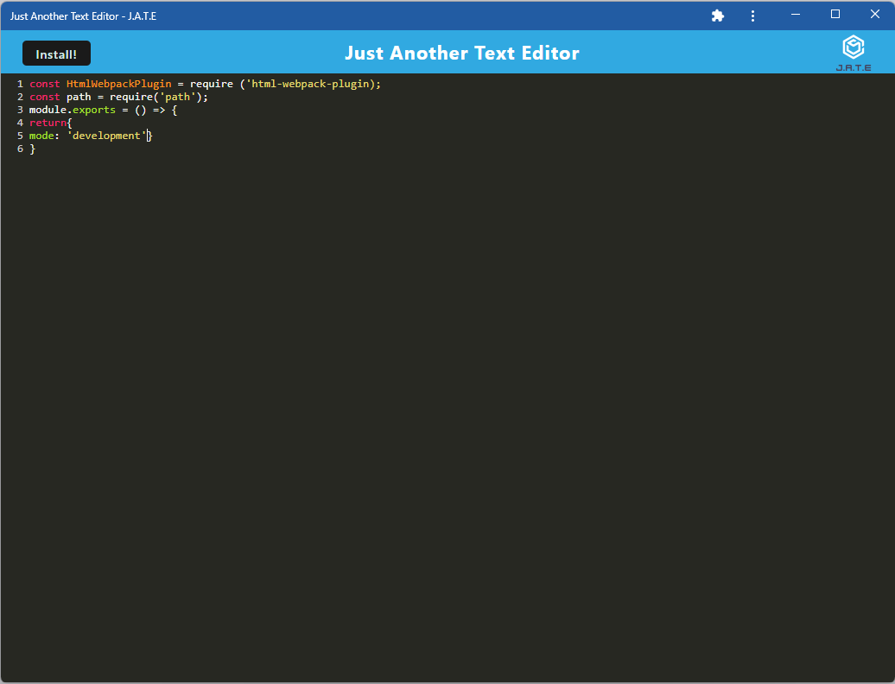

# Cool Text Editor
 
## Description 
This project is a text editor that runs in the browser. It's a single-page application that meets the PWA criteria. Additionally, it features a number of data persistence techniques that serve as redundancy in case one of the options is not supported by the browser. The application alse functions offline.

## Usage
visit the website: <a href="https://cool-editor.herokuapp.com/">small-topic.herokuapp.com</a>
## Screenshot
 

## Links

<a href="https://cool-editor.herokuapp.com/" target="_blank">https://small-topic.herokuapp.com</a>

<a href="https://github.com/Yanbud/cool-editor">https://github.com/Yanbud/small-topic</a>

## License
This project is licensed under the MIT license.
